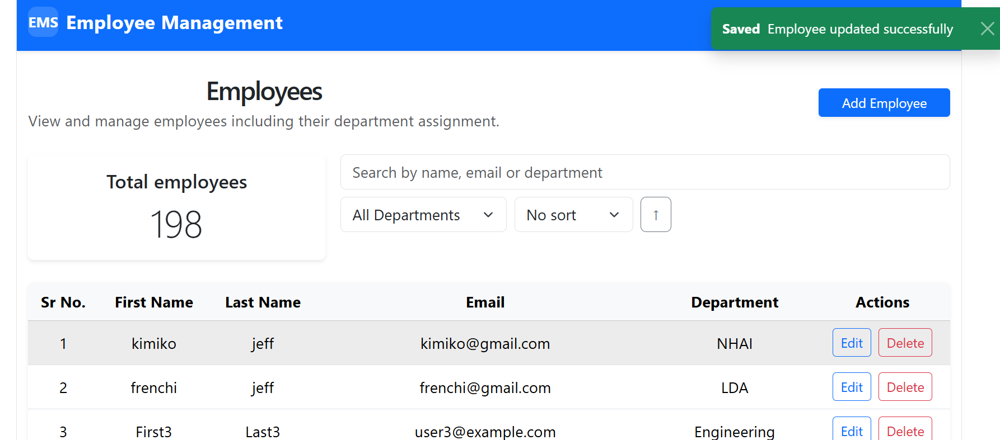
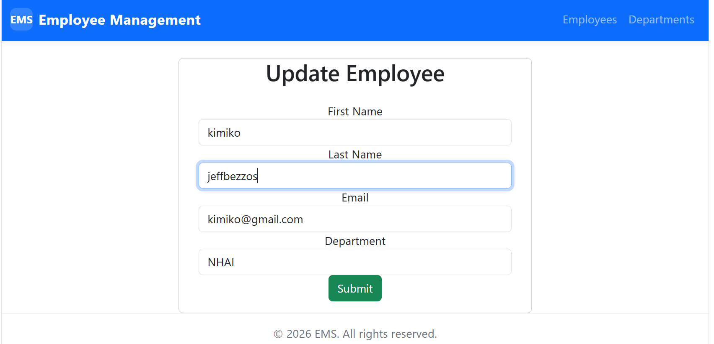

# EMS Full Stack Project

This repository contains the EMS (Employee Management System) full stack application.

## Project structure

- `ems-backend/` - Spring Boot REST API for departments and employees.
- `ems-frontend/` - React + Vite frontend for viewing and managing EMS data.

## Screenshots

Add app screenshots to a `screenshots/` directory at the repository root.

Files included in this repo:
- `screenshots/employees-page.png`
- `screenshots/update-employee.png`

## App Screenshots




## Running the app

### Backend

```powershell
cd ems-backend
./mvnw spring-boot:run
```

### Frontend

```powershell
cd ems-frontend
npm install
npm run dev
```

## Notes

- If you add screenshots later, commit them with the README update.
- Use relative paths in Markdown so GitHub renders the images correctly.
